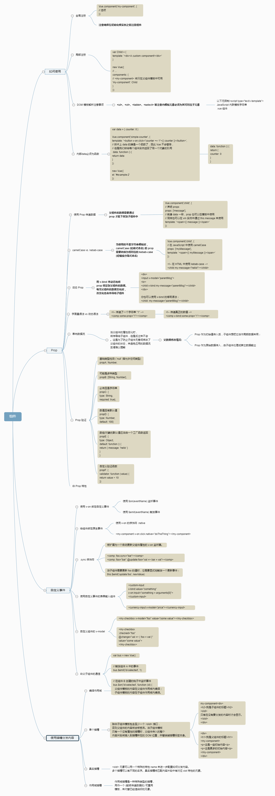

# VueLearning
The Learning process of Vue

### 说明
#### 记录学习Vue的历程
> 2017.12.31 制作一个简单的TodoList 并且学会了Vue的增删改查编辑以及如何用数据驱动Dom

> 2018.1.1 制作一个简单的tab切换 实践了v-show的应用，了解v-if与v-show的区别

> 2018.1.2 正在制作一个简单的购物车，期间用到了vue-resource以及vue的过滤器 filters 在制作期间遇到了vue-resource的跨域问题，然后花时间用node配置一个本地的服务器。搭建成功之后发现引入的模块只能解析html。真是悲催〒▽〒，明天继续努力。

>2018.1.3 在使用过滤器filters的过程中深度学习了 filters的使用场景:

> 2018.1.4 学习了自定义指令以及钩子函数在自定义指令中的实践应用

> 2018.1.5  学习事件处理，.once事件需要自2.1.4版本以上才适用。

> 2018.1.6 学习表单输入绑定

> 2018.1.8 学习vue的生命周期以及其钩子

> 2018.1.9-2018.1.15 认真学习了vue官网上的component，并且整理出一个思维逻辑图


>#### 其可以在（**双花括号插值和 v-bind 表达式** ）中使用  使用方法为
>
>```
><!-- 在双花括号中 -->
>{{ message | capitalize }}
>
><!-- 在 `v-bind` 中 -->
><div v-bind:id="rawId | formatId"></div>
>```

> 组件内定义为filters:{}  全局定义为Vue.filter('',function(){})
>
> 过滤器函数总接收表达式的值 (之前的操作链的结果) 作为第一个参数。

#### 自定义指令


#### 事件处理


### 表单数据绑定


### 生命周期

每个 Vue 实例在被创建之前都要经过一系列的初始化过程。例如需要设置数据监听、编译模板、挂载实例到 DOM、在数据变化时更新 DOM 等。同时在这个过程中也会运行一些叫做生命周期钩子的函数，该函数寓意什么时候，做什么事情。给予用户机会在一些特定的场景下添加他们自己的代码。


###### 关于钩子

---


### 组件

